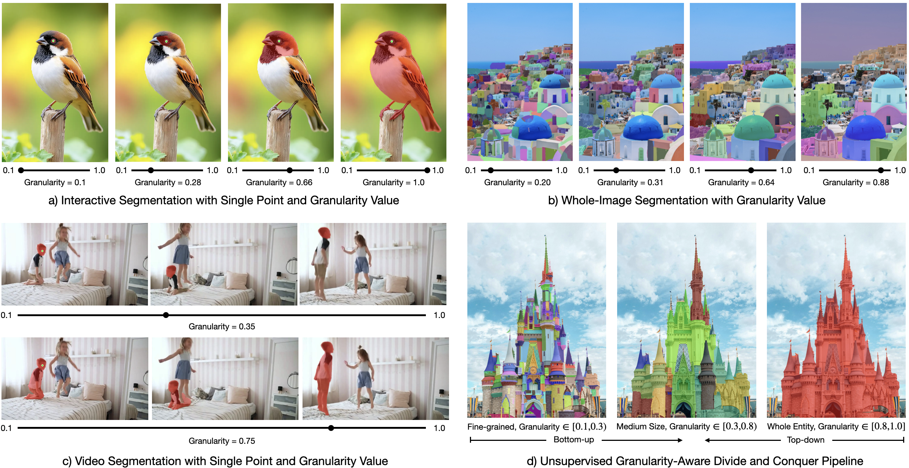
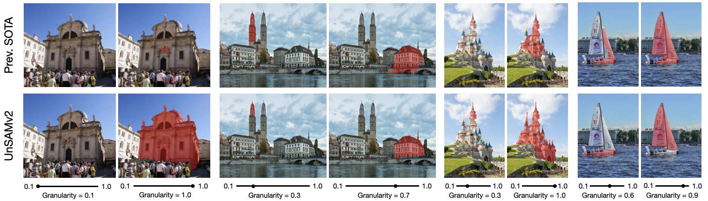
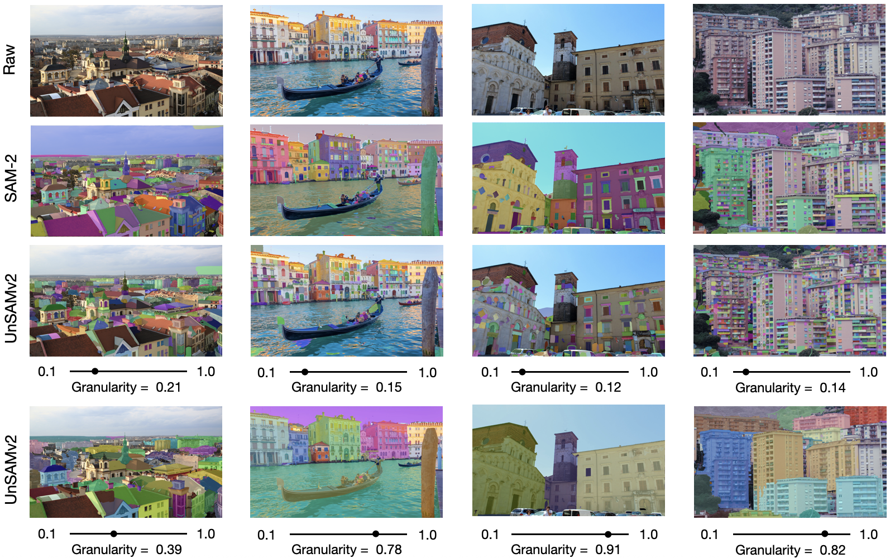
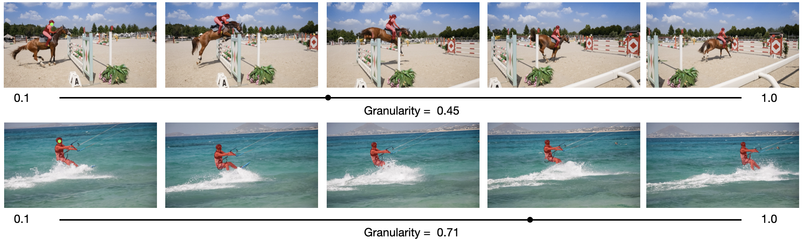

<p align="center">

  <h1 align="center">UnSAMv2: Self-Supervised Learning Enables Segment Anything at Any Granularity</h1>
  <p align="center">
    <a href="https://yujunwei04.github.io/"><strong>Junwei Yu</strong></a>,
    <a href="https://people.eecs.berkeley.edu/~trevor/"><strong>Trevor Darrell</strong></a>,
    <a href="https://people.eecs.berkeley.edu/~xdwang/"><strong>XuDong Wang<sup>*</sup></strong></a>
  </p>
  <p align="center">
    <strong>UC Berkeley</strong><br />
    <small style="font-size:0.75em;"><em>* Corresponding author</em></small>
  </p>
</p>

<h3 align="center">
  <a href="https://yujunwei04.github.io/UnSAMv2-Project-Page/"><strong>Project Page</strong></a>
  |
  <a href="https://arxiv.org/abs/111"><strong>ArXiv (coming soon)</strong></a>
  |
  <a href="https://x.com/111"><strong>HF Demo 😊 (coming soon)</strong></a>
</h3>

<div align="center">
  
  <!--  -->
</div>

## News 🎉
- 11/2025: We released UnSAMv2.

## Installation ⚙️
We provide installation instructions [here](INSTALL.md).

## Method Overview 💡
UnSAMv2 has two stages. (1) We generate pseudo mask-granularity pairs with granularity-aware divide-and-conquer. (2) We utilize these unsupervised data to finetune SAM-2 with granularity module.

### 1. Granularity-Aware Divide-and-Conquer ✌️
To run granularity-aware divide-and-conquer, please download CutLER's weights [here](http://dl.fbaipublicfiles.com/cutler/checkpoints/cutler_cascade_final.pth)

Then, specify the input, output, and checkpoint path in the [script](./granularity_divide_and_conquer/run_gra_dico.sh) and run
```bash
cd granularity_divide_and_conquer
bash run_gra_dico.sh
```

### 2. Segment Anything at Any Granularity 🔥
### UnSAMv2: Inference Demo for Interative Image Segmentation
<div align="center">
  
</div>

### UnSAMv2: Inference Demo for Whole Image Segmentation
<div align="center">
  
</div>

### UnSAMv2: Inference Demo for Video Segmentation
<div align="center">
  
</div>

## Model Zoo 🥳

UnSAMv2 achieves state-of-the-art performance on interactive segmentation and whole image segmentation by finetuning SAM-2 with pseudo-labeled mask-granularity pairs on 6,000 images. 

For interactive segmentation, we report averaged Number of clicks (NoC) and Intersection of Union with 1 click(1-IoU) across 5 datasets: GrabCut, Berkeley, DAVIS, SA-1B, PartImageNet. 

For whole image segmentation, we report Average Recall (AR) on 5 datasets: COCO, LVIS, ADE20K, Entity, SA-1B.

| Method | Models | NoC<sub>80</sub> ↓ | NoC<sub>90</sub> ↓ | 1-IoU ↑ | AR<sub>1000</sub> ↑ |
| --- | --- | --- | --- | --- | --- |
| SimpleClick | - | 3.32 | 4.87 | 60.2 | - |
| UnSAM | - | - | - | - | 39.2 |
| GraCo | - | 2.35 | 3.42 | 74.4 | - |
| SAM-2 | - | 2.44 | 3.63 | 69.0 | 49.6 |
| UnSAMv2 | TODO | 2.28 | 3.40 | 79.3 | 68.3 |
| UnSAMv2+ | TODO | 2.07 | 3.10 | 81.7 | 74.1 |

## Evaluation 😎
### Interactive Segmentation
### Whole Image Segmentation

## License 📋

## Acknowledgements 🙏
This codebase is built on [UnSAM](https://github.com/frank-xwang/UnSAM), [SAM-2](https://github.com/facebookresearch/sam2), [CutLER](https://github.com/facebookresearch/CutLER), [DINOv3](https://github.com/facebookresearch/dinov3), [HQ-SAM](https://github.com/SysCV/sam-hq), and [GraCo](https://github.com/Zhao-Yian/GraCo). We sincerely appreciate the authors for open-sourcing their code.

## Contact ☎️
If you have any general questions, feel free to email us at yujunwei04@berkeley.edu and xdwang@eecs.berkeley.edu. If you have code questions, we encourage you to open an issue in this repo as your question may help others.

## Citation ✨
