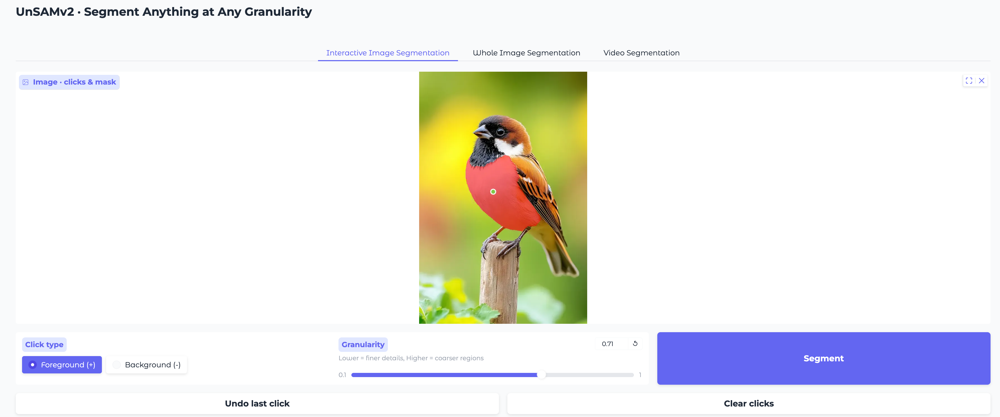
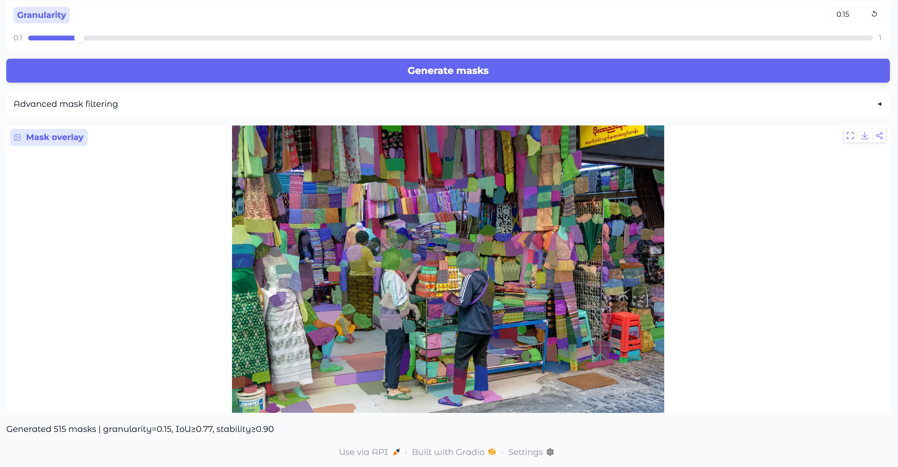
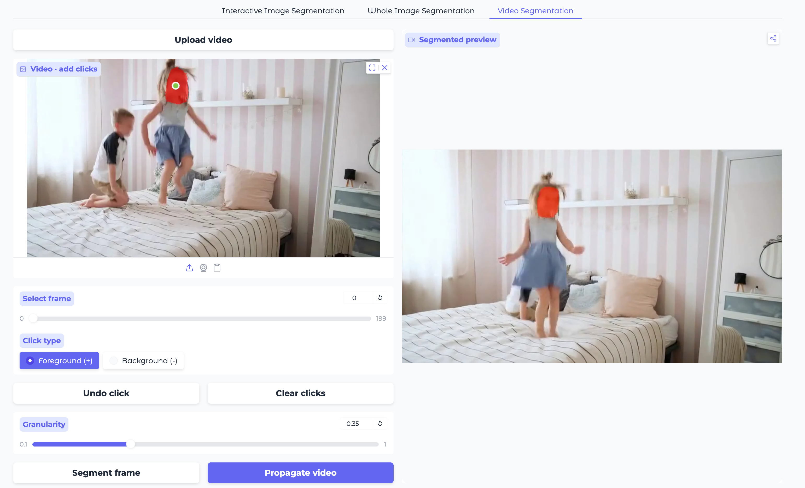
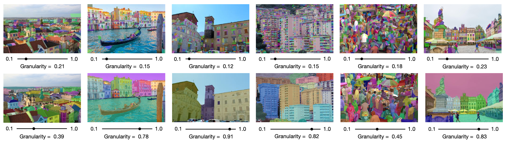

<p align="center">

  <h1 align="center">UnSAMv2: Self-Supervised Learning Enables Segment Anything at Any Granularity</h1>
  <p align="center">
    <a href="https://yujunwei04.github.io/"><strong>Junwei Yu</strong></a>,
    <a href="https://people.eecs.berkeley.edu/~trevor/"><strong>Trevor Darrell</strong></a>,
    <a href="https://people.eecs.berkeley.edu/~xdwang/"><strong>XuDong Wang<sup>*</sup></strong></a>
  </p>
  <p align="center">
    <strong>UC Berkeley</strong><br />
    <small style="font-size:0.75em;"><em>* Corresponding author</em></small>
  </p>
</p>

<h3 align="center">
  <a href="https://yujunwei04.github.io/UnSAMv2-Project-Page/"><strong>Project Page</strong></a>
  |
  <a href="https://arxiv.org/abs/2511.13714"><strong>arXiv</strong></a>
  |
  <a href="https://huggingface.co/spaces/yujunwei04/UnSAMv2"><strong>HF Demo 😊</strong></a>
</h3>

<div align="center">
  
  <!--  -->
</div>

## News 🎉
- 11/17/2025: We released UnSAMv2.

## Demo
We host our model on HuggingFace space, feel free to try our [UnSAMv2 Demo](https://huggingface.co/spaces/yujunwei04/UnSAMv2)! UnSAMv2 support granularity control for interactive image segmentation, whole image segmentation, and video segmentation.

1. Interactive Segmentation: 
Add point prompts and granularity scaler first, and click segment to run inference. Click the little cross icon on the top-right corner if you want to try your own image!


2. Whole Image Segmentation: 
UnSAMv2 supports to find all instance at a given granularity score in images. Click "generate masks" to run inference.


3. Video Segmentation:
UnSAMv2 can propagate mask at your desired granularity across video frames! Firstly, add point prompts and granularity and click "segment frame". Then, we can propagate the mask to later frames by clicking "propagate video."


## Installation ⚙️
We provide installation instructions [here](INSTALL.md).

## Method Overview 💡
UnSAMv2 has two stages. (1) We generate pseudo mask-granularity pairs with granularity-aware divide-and-conquer. (2) We utilize these unsupervised data to finetune SAM-2 with granularity module.

### 1. Granularity-Aware Divide-and-Conquer ✌️
To run granularity-aware divide-and-conquer, please download CutLER's weights [here](http://dl.fbaipublicfiles.com/cutler/checkpoints/cutler_cascade_final.pth)

Then, specify the input, output, and checkpoint path in the [script](./granularity_divide_and_conquer/run_gra_dico.sh) and run
```bash
cd granularity_divide_and_conquer
bash run_gra_dico.sh
```

### 2. Segment Anything at Any Granularity 🔥

We host UnSAMv2 model on HuggingFace Space, feel free to try it out by following [demo](#demo). If you want to run UnSAMv2 or UnSAMv2+ locally, we provide tutorial notebooks for different tasks, please download UnSAMv2/UnSAMv2+ checkpoints from the [model zoo](#model-zoo).

### UnSAMv2: Inference Demo for Interative Image Segmentation
<div align="center">
  
</div>


We provide the tutorial notebook for running UnSAMv2's interactive segmentation [here](sam2/notebooks/interactive_image_segmentation.ipynb).

### UnSAMv2: Inference Demo for Whole Image Segmentation
<div align="center">
  
</div>

We provide the tutorial notebook for running UnSAMv2's whole image segmentation [here](sam2/notebooks/whole_image_segmentation.ipynb).

### UnSAMv2: Inference Demo for Video Segmentation

<div align="center">
  
</div>

We provide the tutorial notebook for running UnSAMv2's video segmentation [here](sam2/notebooks/video_segmentation.ipynb).

## Model Zoo

UnSAMv2 achieves state-of-the-art performance on interactive segmentation and whole image segmentation by finetuning SAM-2 with pseudo-labeled mask-granularity pairs on 6,000 images. 

For interactive segmentation, we report averaged Number of clicks (NoC) and Intersection of Union with 1 click(1-IoU) across 5 datasets: GrabCut, Berkeley, DAVIS, SA-1B, PartImageNet. 

For whole image segmentation, we report Average Recall (AR) on 5 datasets: COCO, LVIS, ADE20K, Entity, SA-1B.

| Method | Models | NoC<sub>80</sub> ↓ | NoC<sub>90</sub> ↓ | 1-IoU ↑ | AR<sub>1000</sub> ↑ |
| --- | --- | --- | --- | --- | --- |
| SimpleClick | - | 3.32 | 4.87 | 60.2 | - |
| UnSAM | - | - | - | - | 39.2 |
| GraCo | - | 2.35 | 3.42 | 74.4 | - |
| SAM-2 | - | 2.44 | 3.63 | 69.0 | 49.6 |
| UnSAMv2 | [Download](https://drive.google.com/file/d/1iYmYFeJxY4aI1lG5F2ZFL8tzzyGkCgX0/view?usp=sharing) | 2.28 | 3.40 | 79.3 | 68.3 |
| UnSAMv2+ | [Download](https://drive.google.com/file/d/1M56QN2CWfou7h5azxJvc_igmbQh9D2af/view?usp=sharing) | 2.07 | 3.10 | 81.7 | 74.1 |

## Evaluation 😎 (Coming soon)

<!-- ## License 📋 -->

## Acknowledgements 🙏
This codebase is built on [UnSAM](https://github.com/frank-xwang/UnSAM), [SAM-2](https://github.com/facebookresearch/sam2), [CutLER](https://github.com/facebookresearch/CutLER), [DINOv3](https://github.com/facebookresearch/dinov3), [HQ-SAM](https://github.com/SysCV/sam-hq), and [GraCo](https://github.com/Zhao-Yian/GraCo). We sincerely appreciate the authors for open-sourcing their code.

## Contact ☎️
If you have any general questions, feel free to email us at yujunwei04@berkeley.edu and xdwang@eecs.berkeley.edu. If you have code questions, we encourage you to open an issue in this repo as your question may help others.

## Citation ✨
If you find our work inspiring or use our codebase in your research, please consider giving us a star ⭐ and a citation!
```bibtex
@article{yu2025unsamv2,
  title={UnSAMv2: Self-Supervised Learning Enables Segment Anything at Any Granularity},
  author={Yu, Junwei and Darrell, Trevor and Wang, XuDong},
  journal={arXiv preprint arXiv:2511.13714},
  year={2025}
}

@article{wang2024segment,
  title={Segment anything without supervision},
  author={Wang, XuDong and Yang, Jingfeng and Darrell, Trevor},
  journal={Advances in Neural Information Processing Systems},
  volume={37},
  pages={138731--138755},
  year={2024}
}
```
